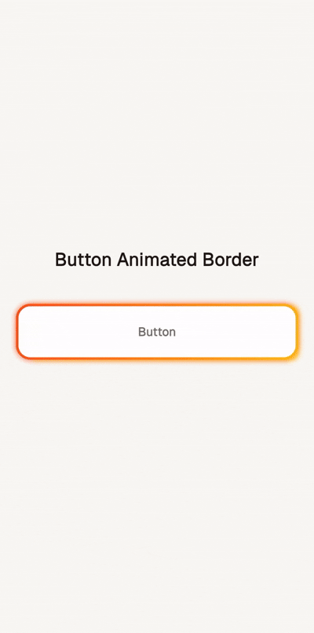

# Animated Button Border

A Flutter widget that creates a button with an animated gradient border that rotates continuously around the button's edges.

## Overview

This widget demonstrates a creative UI effect where a gradient border (transitioning from deep orange to amber) rotates around a button, creating an eye-catching animated effect. The animation uses custom clipping to show only the border while keeping the button's interior clean.

## Example



## Features

- **Rotating Gradient Border**: Smooth gradient animation that rotates 360° around the button
- **Customizable Appearance**: Easy to modify colors, border thickness, and corner radius
- **Performance Optimized**: Uses `AnimationController` with efficient rebuild strategies
- **Custom Clipping**: Leverages `CustomClipper` to create the border effect without affecting the button interior

## How It Works

### Core Components

1. **AnimationController**: Drives the rotation animation with a 3.5-second loop
2. **Custom Clipper** (`_CenterCutPath`): Creates a frame/border effect by clipping out the center
3. **Gradient Rotation**: Uses `GradientRotation` transform to rotate the gradient based on animation progress
4. **Layered Stack**: Combines multiple containers with box shadows and gradients for depth

### Visual Structure

```
Stack
├── Button (white background with rounded corners)
└── Clipped Animated Border
    ├── Deep Orange Shadow Layer
    ├── Amber Shadow Layer
    └── Rotating Gradient Layer
```

## Usage

```dart
import 'package:flutter/material.dart';
import 'animated_button_border.dart';

void main() {
  runApp(MaterialApp(
    home: AnimatedButtonBorder(),
  ));
}
```

## Customization

### Border Thickness

Modify the `thickness` parameter in `_CenterCutPath`:

```dart
clipper: _CenterCutPath(
  radius: 18,
  thickness: 5, // Change border thickness (default: 3)
),
```

### Border Radius

Adjust the `radius` parameter:

```dart
ClipRRect(
  borderRadius: BorderRadius.circular(24), // Change corner radius
  // ...
)
```

### Animation Speed

Change the duration in `AnimationController`:

```dart
_controller = AnimationController(
  vsync: this,
  duration: const Duration(milliseconds: 2000), // Faster rotation
)
```

### Gradient Colors

Modify the gradient colors in the `LinearGradient`:

```dart
colors: const [
  Colors.purple,
  Colors.blue,
  Colors.cyan,
],
```

### Button Content

Replace the button text and styling:

```dart
child: const Row(
  mainAxisAlignment: MainAxisAlignment.center,
  children: [
    Icon(Icons.star, color: Colors.black54),
    SizedBox(width: 8),
    Text(
      'Custom Button',
      style: TextStyle(
        fontSize: 18,
        fontWeight: FontWeight.bold,
        color: Colors.black87,
      ),
    ),
  ],
),
```

## Technical Details

### _CenterCutPath Clipper

The custom clipper creates a border effect by:
1. Creating an outer rectangular path that extends beyond the widget bounds
2. Adding an inner rounded rectangle (the "cut-out" center)
3. Using `PathFillType.evenOdd` to create the frame effect

### Animation Calculation

```dart
final angle = _controller.value * 2 * math.pi;
```

This converts the animation value (0.0 to 1.0) into radians (0 to 2π) for full 360° rotation.

## Requirements

- Flutter SDK
- Dart 2.12 or higher (for null safety)

## Dependencies

```yaml
dependencies:
  flutter:
    sdk: flutter
```

## Performance Considerations

- The `AnimatedBuilder` ensures only the animated portion rebuilds
- `SingleTickerProviderStateMixin` provides efficient animation ticking
- `AnimationController` is properly disposed to prevent memory leaks

## License

This code is provided as-is for educational and commercial use.